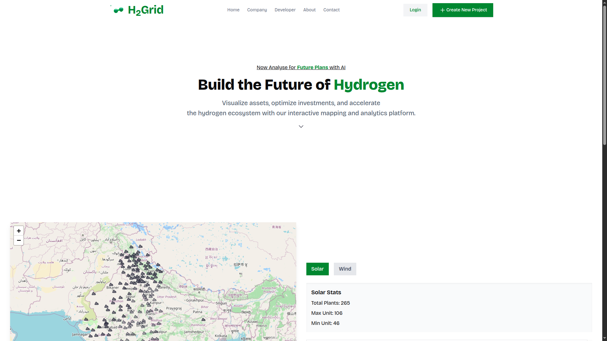

# H<sub>2</sub>Grid - Green Hydrogen Infrastructure Mapping and Optimization


## Overview

H2Grid is a map-based tool designed to accelerate the development of the hydrogen ecosystem. It visualizes existing and planned hydrogen infrastructure, such as plants, storage facilities, pipelines, and distribution hubs. By leveraging data-driven models, H2Grid provides site selection recommendations for new hydrogen projects based on key criteria like proximity to renewable energy sources, market demand, regulatory zones, and cost optimization.

## Features

- **Interactive Map**: Visualize hydrogen infrastructure across India with layered data on renewable energy sources, demand centers, and transport logistics.
- **Site Selection Recommendations**: Data-driven suggestions for optimal project locations based on proximity to renewables, market demand, regulatory zones, and cost efficiency.
- **User-Friendly Interface**: Modern, responsive design for seamless interaction and visualization.
- **Charts & Analytics**: Dynamic visualizations showing hydrogen production, consumption, and cost trends across regions in India.
- **Indian Map Integration**: Geospatial mapping of renewable resources, demand centers, and infrastructure specifically for Indian states and cities.
- **Marketplace Module**: The platform features a dedicated Marketplace where industry stakeholders can buy and sell key hydrogen-related raw materials and components, including electrolyzer parts, catalysts, membranes, and hydrogen carriers such as ammonia and methanol.

## Demo Images

Explore H2Grid's features through the following screenshots:

|  |  |
| :-----------------------------------------------: | :----------------------------------------------: |

|  |  |
| :-------------------------------------------: | :-----------------------------------------------------: |

|  |  |
| :----------------------------------------------: | :-------------------------------------------------: |

|  |  |
| :----------------------------------------------: | :--------------------------------------------------: |

<p align="center">
  
  
  
  
  
  
  
  
</p>

## Installation

1. Clone the repository:
   ```bash
   git clone https://github.com/udaykumar-dhokia/CodeOverflow-DAIICT-HackOut25
   .git
   ```
2. Navigate to the project directory:
   ```bash
   cd CodeOverflow-DAIICT-HackOut25
   ```
3. Install frontend dependencies:
   ```bash
   cd frontend
   npm install
   ```
4. Install backend dependencies:
   ```bash
   cd ../backend
   npm install
   ```
5. Set up Python environment for data processing:
   ```bash
   cd ../data-processing
   pip install -r requirements.txt
   ```
6. Configure environment variables:
   - Create a `.env` file in the `backend` directory with necessary API keys and configurations.
   - Example:
     ```
     PORT=3000
     MONGODB_URL=your-database-url
     JWT_SECRET=YOUR_SECRET
     ```

## Usage

1. Start the backend server:
   ```bash
   cd backend
   npm run dev
   ```
2. Start the frontend development server:
   ```bash
   cd frontend
   npm run dev
   ```
3. Run the Python data processing scripts (if applicable):
   ```bash
   cd data-processing
   python main.py
   ```
4. Open your browser and navigate to `http://localhost:5173` (or the port specified by Vite) to access the H2Grid application.

## Contributing

We welcome contributions to improve H2Grid! To contribute:

1. Fork the repository.
2. Create a new branch (`git checkout -b feature/your-feature`).
3. Commit your changes (`git commit -m "Add your feature"`).
4. Push to the branch (`git push origin feature/your-feature`).
5. Open a pull request.

Please ensure your code adheres to the project's coding standards and includes relevant tests.

## Team Members

Meet the team behind H2Grid! Each member contributes unique expertise to make this project a success.

| Name             | Role                 | Profile                                       |
| ---------------- | -------------------- | --------------------------------------------- |
| Udaykumar Dhokia | Full-Stack Developer | [GitHub](https://github.com/udaykumar-dhokia) |
| Prasanna H.      | Backend Developer    | [GitHub](https://github.com/prasanna00019)    |
| Vaibhavi Katiyar | AI Developer         | [GitHub](https://github.com/vaibhavi089)      |

## License

This project is licensed under the MIT License. See the [LICENSE](LICENSE) file for details.

## Thank You

A huge thank you to our amazing community! H2Grid has received  stars on GitHub, and we’re incredibly grateful for your support. If you find this project useful, please consider giving it a star 🌟 to help us grow the hydrogen ecosystem further!

## Contact

For questions or feedback, please reach out to [udaykumardhokia@gmail.com](mailto:udaykumardhokia@gmail.com) or open an issue on GitHub.
